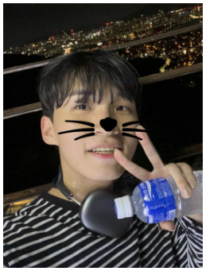
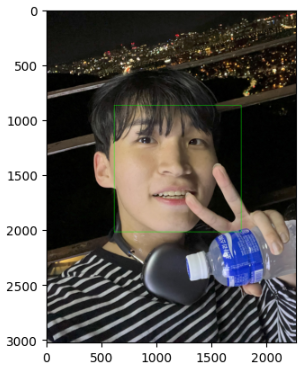
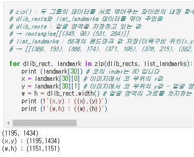
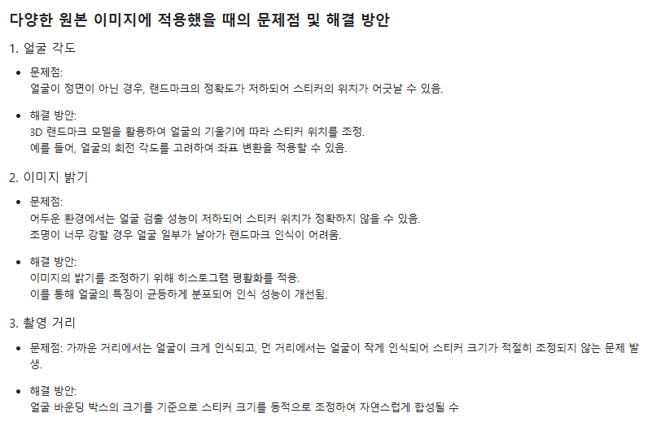
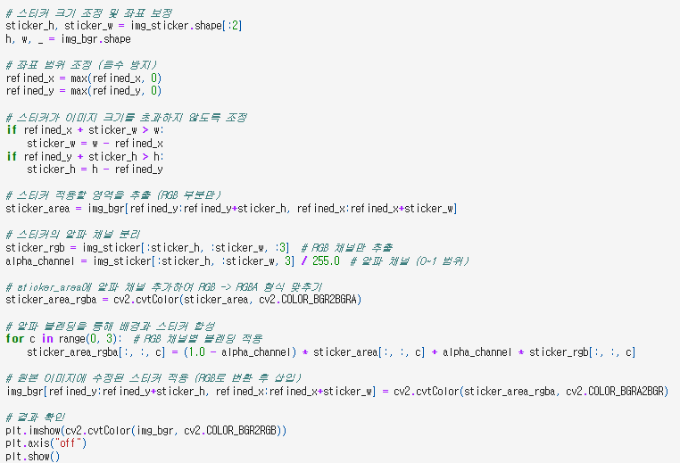

# AIFFEL Campus Online Code Peer Review Templete

- 코더 : 코더의 이름을 작성하세요.
- 리뷰어 : 리뷰어의 이름을 작성하세요.

# PRT(Peer Review Template)

- [x] **1. 주어진 문제를 해결하는 완성된 코드가 제출되었나요?**
  - 문제에서 요구하는 최종 결과물이 첨부되었는지 확인
    - 
    - 
    - 얼굴 인식을 제대로 한 결과물을 도출하였음.
    - 얼굴 좌표를 잘 추출하여 이미지 합성에 성공하였음.
    - 실험 내용을 잘 정리 하였음.
- [x] **2. 전체 코드에서 가장 핵심적이거나 가장 복잡하고 이해하기 어려운 부분에 작성된
      주석 또는 doc string을 보고 해당 코드가 잘 이해되었나요?** - 해당 코드 블럭을 왜 핵심적이라고 생각하는지 확인 - 해당 코드 블럭에 doc string/annotation이 달려 있는지 확인 - 해당 코드의 기능, 존재 이유, 작동 원리 등을 기술했는지 확인 - 주석을 보고 코드 이해가 잘 되었는지 확인 - [alt text](image.png) - 본인이 새롭게 작성한 코드를 타인이 알아볼 수 있게 주석을 잘 작성하였음.
- [x] **3. 에러가 난 부분을 디버깅하여 문제를 해결한 기록을 남겼거나
      새로운 시도 또는 추가 실험을 수행해봤나요?** - 문제 원인 및 해결 과정을 잘 기록하였는지 확인 - 프로젝트 평가 기준에 더해 추가적으로 수행한 나만의 시도,
      실험이 기록되어 있는지 확인 -  -  - landmark 오류가 나는 부분을 미리 합성하는 방식으로 문제를 해결하였음. - 오류를 맞았지만 문제를 잘 해결하여 결과물을 도출하였음. - 문제 원인을 파악하기 위해서 좌표를 직접 출력하는 시도가 보였음.
- [x] **4. 회고를 잘 작성했나요?**
  - 주어진 문제를 해결하는 완성된 코드 내지 프로젝트 결과물에 대해
    배운점과 아쉬운점, 느낀점 등이 기록되어 있는지 확인
  - 전체 코드 실행 플로우를 그래프로 그려서 이해를 돕고 있는지 확인
    - 
    - 회고를 얼굴 각도, 이미지 밝기, 촬영 거리 등 3가지 실험 조건에서 실험한 내용을 문제점과 해결방안으로 나누어서 알아보기 쉽게 정리하였음.
- [x] **5. 코드가 간결하고 효율적인가요?**
  - 파이썬 스타일 가이드 (PEP8) 를 준수하였는지 확인
  - 코드 중복을 최소화하고 범용적으로 사용할 수 있도록 함수화/모듈화했는지 확인
    - 
    - 코드의 군더더기 없이 주석으로 깔끔한 설명과 함께 간결하게 작성되었음.

# 회고(참고 링크 및 코드 개선)

```
# 전체적으로 코드가 깔끔하였고 문제에 마주했을 때 문제를 파악하고 해결한 모습이 매우 인상적이었습니다.
# landmark 문제는 커널 환경에서 한번 더 테스트 해보면 문제 원인 파악에 용이할 것 같습니다.
```
